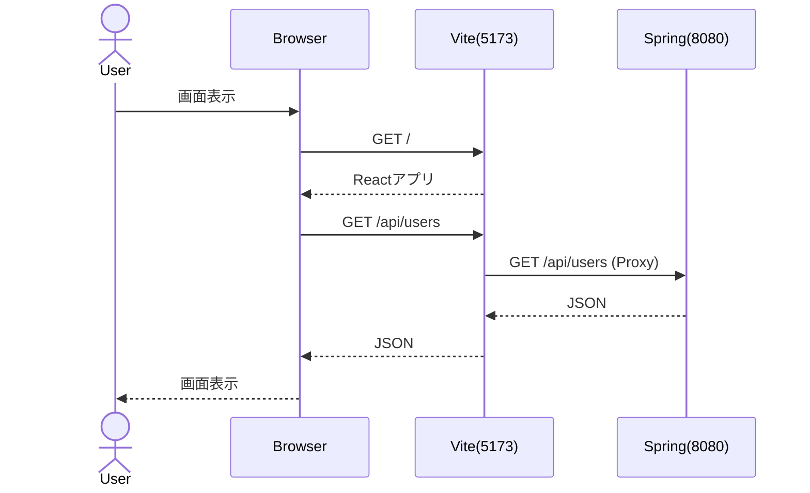
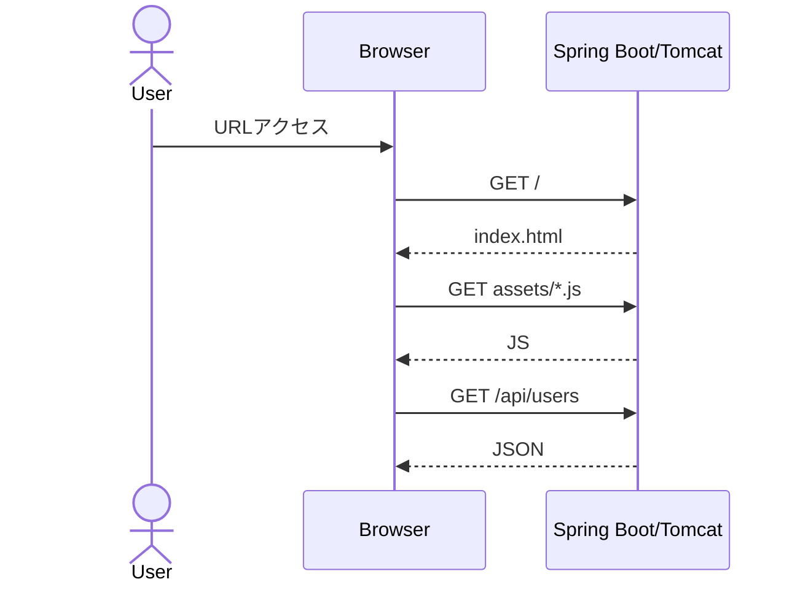
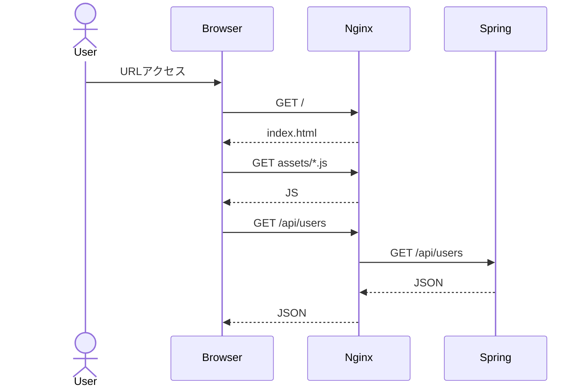

# 構成図

## 開発中

```mermaid
sequenceDiagram
actor User
participant Browser
participant Vite as Vite(5173)
participant Tomcat as Spring(8080)

    User->>Browser: 画面表示
    Browser->>Vite: GET /
    Vite-->>Browser: Reactアプリ

    Browser->>Vite: GET /api/users
    Vite->>Tomcat: GET /api/users (Proxy)
    Tomcat-->>Vite: JSON
    Vite-->>Browser: JSON

    Browser-->>User: 画面表示
```

## 本番環境

- Tomcatだけで完結させる場合の構成

```mermaid
sequenceDiagram
    actor User
    participant Browser
    participant Spring as Spring Boot/Tomcat

    User->>Browser: URLアクセス

    Browser->>Spring: GET /
    Spring-->>Browser: index.html

    Browser->>Spring: GET assets/*.js
    Spring-->>Browser: JS

    Browser->>Spring: GET /api/users
    Spring-->>Browser: JSON
```

- 静的ファイルの配信用に専用サーバを立てる場合の構成

```mermaid
sequenceDiagram
    actor User
    participant Browser
    participant Nginx
    participant Spring

    User->>Browser: URLアクセス

    Browser->>Nginx: GET /
    Nginx-->>Browser: index.html

    Browser->>Nginx: GET assets/*.js
    Nginx-->>Browser: JS

    Browser->>Nginx: GET /api/users
    Nginx->>Spring: GET /api/users
    Spring-->>Nginx: JSON
    Nginx-->>Browser: JSON
```
